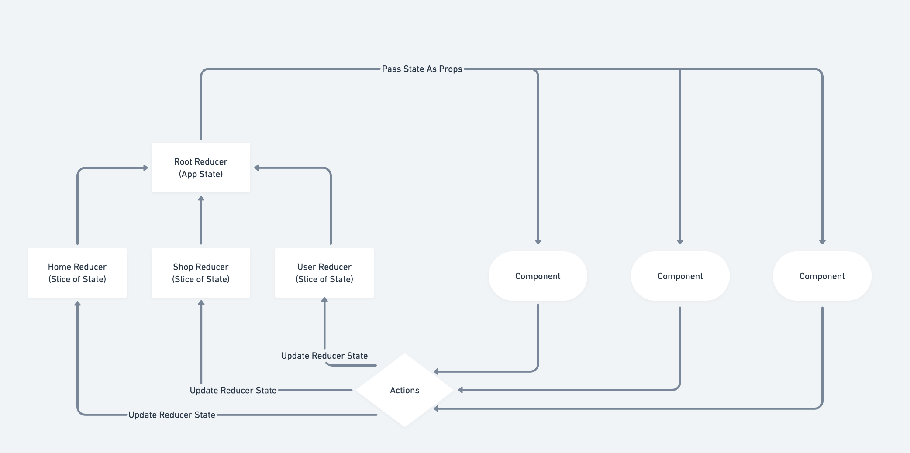
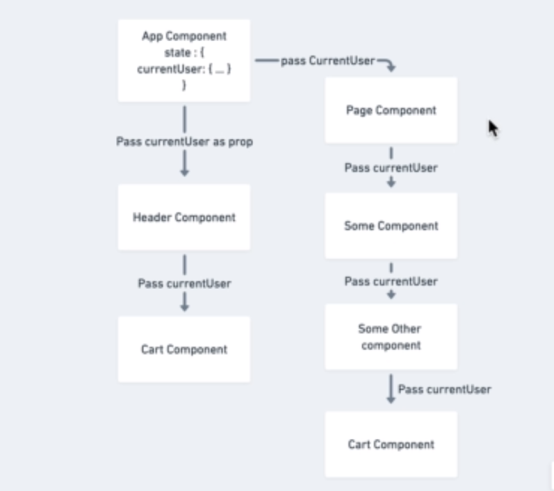
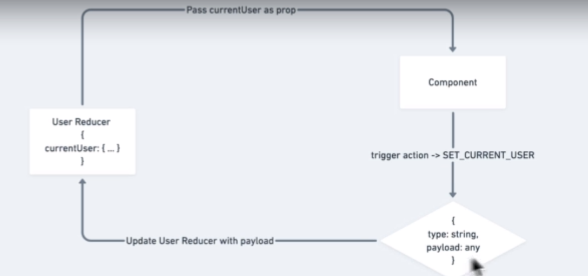

## Project's Notes:

  * A page is a component that is not going to be used more than once, but a component is a reusable one.
  * Our files structure will account for that difference by having two folders, onr for components and the other for pages.

  * For having a background image that scales on hover:
    - [Stackoverflow](https://stackoverflow.com/questions/35939859/how-do-i-animate-background-image-size-on-hover-smoothly-in-css)
    - [CSS-Tricks](https://css-tricks.com/zooming-background-images/)

    - The key takeaway: Always wrap the div with bg-img inside a wrapper, and give that div a height and width of 100%.

---

### Routing In React:

  *Showing a specific page based on what URL in address bar*

  * Browsers are built around the idea of clicking a link and getting an HTML page with resources (js and css) for that page.
  * React on the other hand is built around javascript manipulating the DOM. And there is no extra pages fetching.
  * A major problem with SPA was the back button in browsers, as mentioned above, SPA libraries and frameworks did not have the idea of links.
  * But this was solved when the browsers introduced the History API, it is what React uses to hijack or mimic urls.

  * Using the `react-router-dom` library is considered a standard right now.
  * And the most used type of routers is `BrowserRouter`:
  ```javascript
  // Wrap the App with the router
  ReactDOM.render(
    <BrowserRouter>
      <App />
    </BrowserRouter>,
    document.getElementById('root')
  );

  // Then inside the App:
  function APP () {
    return (<div>
      <Route exact path="/" component={Homepage} />
      <Route exact path="pageOne" component={pageOneComponent} />
      <Route exact path="pageTwo" component={pageTwoComponent}/>
    </div>)
  }

  // Another Component worth mentioning is the `Switch` component
  // And is used by wrapping Route components.
  // The <Switch /> component will only render the first route that matches/includes the path. Once it finds the first route that matches the path, it will not look for any other matches. Not only that, it allows for nested routes to work properly, which is something that <Router /> will not be able to handle.
  function APP () {
    return (<div>
    <Switch>
    <!-- exact now is only used on the root "/" route -->
      <Route exact path="/" component={Homepage} /> 
      <Route path="pageOne" component={pageOneComponent} />
      <Route path="pageTwo" component={pageTwoComponent}/>
    </Switch>
    </div>)
  }
  ```

  * when a component is rendered by `<Route>` component, three props are passed along with the props object of the component rendered.
  * These three attributes are: 
    - `match`: contains the `url` matched and caused the component to be rendered. And any url parameters. `url` is used for building dynamic routing with <Link> component (match.url + someId)
    - `location`: tells us where we are now, using `pathname` property.
    - `history`: the main thing here to focus on is `push`, this push is used instead of (and equivalent to) the <Link> component.

  * When navigating we use `<Link>` react-router component or history.push as mentioned above.
  ``` xml
  <Link to="/another-resource">Click Here</Link>
  ```
  The idea here is that we're not re-rendering the app, but manipulating the DOM to hide and show components based on the url.
  * if an anchor tag is used, this would cause the entire app to re-render. 

  * There is a **BAD PRACTICE** called *prop tunneling/drilling*, which means passing props from parent to children deep in the tree.
  * This could occur when passing `history` object from a Homepage down to Directory, then to MenuItems components (like in our app)
      ```text
      <Homepage> Rendered when "/" is visited => pass the history,location,match down to <Directory> => pass them again down to <MenuItem>
      ```
  * A solution to this is using `withRouter()` HOC. that gives us access to history, location, and match objects.

  * Pay close attention to anonymous function calls like `map`, `filter`,...etc. inside our apps, because they are run every time the components gets rendered.

---

### Authentication:

  * In this App, Firebase was used for storing data(firestore), and also their authentication server, that allows Oauth (like sign in with google) and regular email/password login.

  * The main pattern used in authentication in the app is event based. Whether we login (w/ email/password or google) or sign up, we subscribed to firebase `onAuthChange` method to send us back any change in the app's  `componentDidMount` lifecycle method.

  * Firebase keeps auth users in their auth server, but we need to save them in our datastore (firestore). So there is a function called `createUserProfileDocument` that checks if the user causing the event to be triggered (login/signup) is in our DB or not (if not save him).

  * We rely on firebase's user session persistence.

---

### Redux Introduction:

  * Redux introduces the idea of a store that holds all the attributes we need across all our components. Instead of making state local we globalize it in a store and these attributes gets passed down to components from the store as props by connecting the component to the store.

  * check this [article](https://kentcdodds.com/blog/application-state-management-with-react) to avoid some misconception about redux.

  * Concepts of Redux:
    - Redux solves the issue when state gets really complicated.
    - Useful for sharing data between components.
    - Predictable state management using three principles:
      1. Single source of truth (store)
      2. State is read only (immutable object)
      3. Changes using pure functions (for some input, we guarantee the output is predicted).

  * Redux flow could be summarized as follows: Action(s) => Root Reducer => Store => DOM changes.

  * Redux uses architectural pattern called [**Flux Pattern**](https://facebook.github.io/flux/docs/in-depth-overview/#:~:text=Flux%20is%20the%20application%20architecture,a%20lot%20of%20new%20code.).

  

  * **Why use redux?** -Ans. To get a better understanding, when we look at our app at [this commit](https://github.com/mu-majid/react-bootcamp/commit/866ad654f8d11b9409e53193ddfeece27027a8b7), If we need the currentUser state to be in a Cart component that will be inside the Header component, we will be drilling the currentUser state from the App -> Header -> Cart.

  

  * Actions are objects that gets send from Components to reducers, and update the state that in turn updates the components connected to that piece of state.

  

  * Reducers are just functions that gets all dispatched actions, and each reducer determines whether it is concerned about an action or not by utilizing a Switch Statement to check on the action `type`.

  * Also remember to return a new object when updating state from reducers. New objects means new memory addresses which means the state changed and causes re-render.

  * Another piece in redux flow, is `Middleware`, which gets fired before the action reaching the reducer.

  * React Redux selectors are functions that pull out some piece of a state from the store and aggregates/uses it to show some information inside a react component. An example is showing the count of items inside a shopping cart on the cart icon, this uses the count or the quantity of all items in cart to show the number.

  * An issue with this selector, is that it re-renders the component it is being used in as every time redux reducers return a new object, and `mapStateToProps` inside the component gets called even if the changed state is not used in the selector.

  * A solution for this issue is to memoize the value that the selector operate on. and to do so there is a library called `reselect`.

  * Components `cart-dropdown` and `cart-icon` use this memoized redux selectors, so that they don't get re-rendered when unrelated state (anything except cartItems state) changes.

  * The take away here is that redux's `mapStateToProps` has a shallow equality check for every value in the object; it won't replace values if they pass a shallow equality check which means it won't needlessly re-render, but if we have transformation (like reducing items to a single count number) logic it's still valuable to memoize it with a selector to save us running duplicate logic to get the same output.

  * connect function passes the `dispatch` function as a prop to the connected component if mapDispatchToProps is not specified.

### Session Storage and Persistence:

  * Remember our user status is handled by firebase, so right now the logged in user session persistence is not handled by our application.

  * If the user reloads the page, he/she would lose all the app's state (like cart Items).

  * `redux-persist` is a library that uses local storage to store the current state of an app.

  * Session storage stores data during a session (an opened tab), and local storage stores data until we clear it.

### Data Normalization: 

  * Whenever the data is in an array data structure, and there will be a search query (find, filter, ...) on it, and this array tends to get big. Data normalization is used which basically means we convert the array into object for shorter search time.

  * The idea is well explained [here](https://www.kirupa.com/html5/hashtables_vs_arrays.htm)

### CSS In JS (Styled Components):

  * Remember that CSS share a global namespace, so classnames should be unique (or grouping elements that are intended to have these classes).
  * BEM is used as a rule for naming our CSS classes (but it tends to get big and we end up having so many classes)
  * CSS in JS is essentially a js library that allows us to write CSS in js objects, but this also has some cons.
  * One of the benefits of CSS in JS is it aligns with the components concepts react uses, meaning that all the styles are scoped to its components.
  * The styled-components library is the most popular one. It creates unique classnames for the styled component.
  * One of the most powerful features of the styled components library is the ability to access props inside the css.

### Observables/Observers Pattern:

  * Observable is a piece of code that wraps around the stream (data, or events) to be able to do something with it.
  * Observer (listener) is another piece of code that has three main functions: 
    1. `next`: (nextValue => {})
    2. `error`: (error => {})
    3. `complete`: (() => {})

  * When we create a subscription, we are binding the observer to the observable, and telling the observable to run the observer's main functions on the stream of data that it (observable) gets.

### Async Redux:

  * `redux-thunk` is a library that is used to have async actions in redux. Async actions for example are like trying to fetch data from a third party API.
  * The main idea is that thunk middleware checks if the action creator returns a function, and if so, it passes the `dispatch` function as a first argument to the function returned from the action creator. 

### Sagas :
  * A good way to think sagas is to to imagine them as functions that condintionally run.
  * When sagas are used, we are giving more and more reponsibilty to redux instead of just handling state.
  * we put every async or impure code/functions in these sagas to separate it from our react code.
  * Reducers fire first, then sagas receive the action. From there, sagas can fire off new actions which in turn hit the reducers and other sagas as well!
  * Sagas are using the same concept of generators, that stop the execution and resumes it.

  * `takeEvery`: takeEvery allows concurrent actions to be handled. In the example above, when a USER_REQUESTED action is dispatched, a new fetchUser task is started even if a previous fetchUser is still pending (for example, the user clicks on a Load User button 2 consecutive times at a rapid rate, the 2nd click will dispatch a USER_REQUESTED action while the fetchUser fired on the first one hasn't yet terminated)

  takeEvery doesn't handle out of order responses from tasks. There is no guarantee that the tasks will terminate in the same order they were started. To handle out of order responses, you may consider `takeLatest`.

### React Hooks API: 

  * One of the main purposes react hooks were introduced, is to have same functionality used in class components within functional components.
  * Like for example the internal state that was only used with class components.
  * `useState` hook allows us to have internal state inside a functional component as we would have in a class component.
  * `useEffect` hook allows us to fire side effects inside our component.
  * Remember useEffect could be called conditionally, but you have to make the if statement inside the useEffect call.

  ComponentDidMount
  ``` Javascript
    //Class
    componentDidMount() {
        console.log('I just mounted!');
    }
    
    //Hooks
    useEffect(() => {
        console.log('I just mounted!');
    }, [])
  ```


  ComponentWillUnmount
  ``` javascript
    //Class
    componentWillUnmount() {
        console.log('I am unmounting');
    }
    
    //Hooks
    useEffect(() => {
        return () => console.log('I am unmounting');
    }, [])
  ```


  ComponentWillReceiveProps
  ``` javascript
    //Class
    componentWillReceiveProps(nextProps) {
        if (nextProps.count !== this.props.count) {
            console.log('count changed', nextProps.count);
        }
    }
    
    //Hooks
    useEffect(() => {
        console.log('count changed', props.count);
    }, [props.count])
  ```

  * react router hooks docs: https://github.com/ReactTraining/react-router/blob/master/packages/react-router/docs/api/hooks.md
  * react redux hooks docs: https://react-redux.js.org/api/hooks
  * react useEffect Hook docs: https://overreacted.io/a-complete-guide-to-useeffect/

### React Context API:
  * The motivation behind context API is to save some states in a context object and make other components hook themselves into that context object and use these states.
  * This could be used to prevent the prop drilling anti pattern.
  * Contexts could be used in this way: 

  ``` javascript
  <YourContext.Consumer>
    {
      contextStoredObject => {
        // do you logic
        return (
          <div>
            // Your JSX Here.
          </div>
        )
      }
    }
  </YourContext.Consumer>
  ```

  or could be consumed useing the `useContext()` hook, which you provide the context as an argument and get back whatever the context is wrapping.

  * the consumer will look up the tree for a provider (for the same context), and if it did not find any, will use the initial value for the state it is trying to access.
  * So provider should wrap a component that inside of it uses the consumer.
  * Any consumer leveraging a provided value, will re-render whenever the provided value changes.
  * I t does not replace redux, it just tries to solve the prop drilling problem, because if you used context api, you will eventually need to handle state locally, and pass it around to deeply nested components (with the provider/consumer paradigm)
